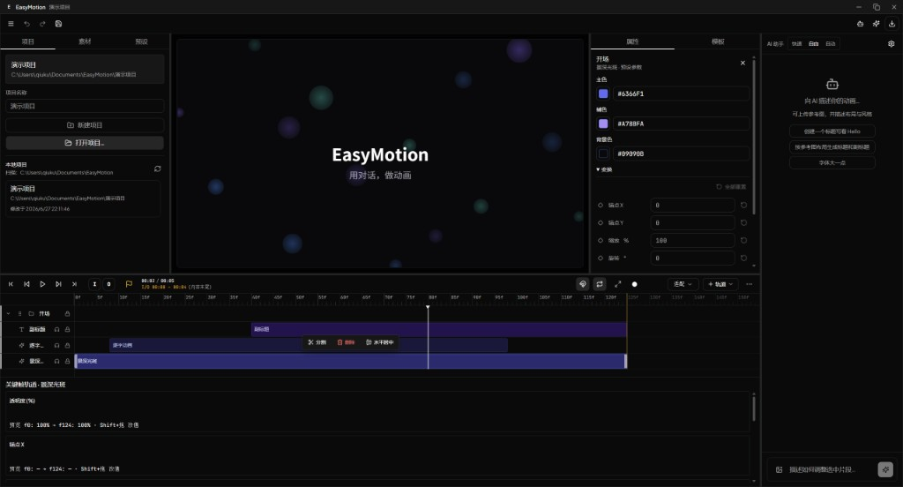

# EasyMotion

> 用自然语言制作 Remotion 动画 —— Electron 桌面应用（React + LangChain Agent）  
> M0–M9 ✅ · Windows 预发行版可用（后续以功能增强为主）



EasyMotion 让剪辑师和内容创作者用**对话**驱动时间线编辑，实时预览 Remotion 动画，并导出视频或完整工程。内置 **81 个 RVE 预设**、关键帧编辑、素材库与 AI 助手。

## 核心能力

- **自然语言编辑**：LangChain Agent 修改时间线 JSON，预览自动刷新
- **动态预览**：`MainSequence` 运行时渲染预设 `props` 与关键帧（`apply-keyframes`）
- **时间线**：拖拽、吸附、I/O 工作区、撤销/重做、底部关键帧轨道
- **预设库**：单击查看 / 双击应用 / 拖到时间线；参数面板全量可编辑
- **素材库**：导入、搜索、分类；收藏与最近使用（左栏「素材」Tab）
- **导出**：MP4 / WEBM（进度与取消）、Remotion 工程 ZIP
- **Remotion Code Agent（M5.2）**：AI 读写用户项目内自定义 TSX 组件

**界面布局**：左栏 项目 / 素材 / 预设 · 中栏 16:9 预览 · 右栏 属性 / 模板 · 底栏 时间线 · 最右 AI 助手通高列。

## 下载

Windows x64 预发行安装包（未签名，SmartScreen 可能提示）：

- 百度网盘：[EasyMotion-Setup.exe](https://pan.baidu.com/s/1IszD8X-GDhq-hjcH9cN0Lg?pwd=ncwr) · 提取码 `ncwr`
- 或本地构建：`pnpm build:win` → `apps/electron/release/EasyMotion-Setup-*.exe`

安装版已内置 Python。首次使用 AI 请在 **AI 助手 → 设置** 填入 API Key。问题反馈见 [Issues](https://github.com/qiuku2022/Easy-Motion/issues)。

## 快速开始

**环境**：Node.js 20+ · pnpm 10+ · Python 3.11+（仅 `dev:all` / 打安装包时需要）

```bash
pnpm install
python -m pip install -r apps/python/requirements.txt   # 可选，Python 功能

# 克隆后生成预设动图缩略图（81 个 WebP，未纳入 Git，需 Chrome + ffmpeg）
cd apps/electron && pnpm generate:preset-thumbnails

pnpm dev          # 日常开发
pnpm dev:all      # + Python FastAPI
```

AI Key：应用内 **AI 助手 → 设置**，或复制 `apps/electron/.env.example` → `.env`。

| 命令 | 作用 |
|------|------|
| `pnpm lint` / `pnpm test` | 代码检查 / 主进程测试 |
| `pnpm --filter @easymotion/electron test:m8` | 导出与 ZIP |
| `pnpm --filter @easymotion/electron test:m5.2` | Remotion Code Agent |
| `pnpm dev:legacy` | 旧版 HTML UI（`--legacy-ui`） |

Electron 开发模式加载 **`http://127.0.0.1:5173`**（勿用 `localhost`，Windows 可能仅 IPv6）。

### 预设缩略图

```bash
cd apps/electron
pnpm generate:preset-thumbnails              # 全部（约 30–40 分钟）
pnpm generate:preset-thumbnails --only rve-pie-chart
pnpm generate:preset-thumbnails --skip-existing
```

未生成时预设库仍可用，卡片显示渐变占位。输出：`resources/presets/thumbnails/` 与 `src/renderer/public/presets/thumbnails/`。

打安装包前需**至少生成一次**（或确保 `resources/presets/thumbnails/*.webp` 已存在）；`build:renderer` 会自动同步到 Vite `public/`。

## 打包 Windows 安装包

**环境**：在 **Windows x64** 本机构建（Python venv 不可交叉编译）。需本机已装 Python 3.10+。

```bash
pnpm build:win
```

流程：同步预设缩略图 → Vite 构建 → 打包 Python venv → `electron-builder`（NSIS）。

| 产物 | 路径 |
|------|------|
| 安装程序 | `apps/electron/release/EasyMotion-Setup-*.exe` |
| 免安装目录 | `apps/electron/release/win-unpacked/` |

安装版会 bundled 启动 Python FastAPI（`127.0.0.1:8000`），无需用户单独安装 Python。当前为**未签名测试包**，SmartScreen 可能提示。

细分命令：

```bash
pnpm build:python                              # 仅打 Python bundle
pnpm --filter @easymotion/electron build:dir   # 仅目录，不生成 NSIS
```

详见 [`docs/requirements/构建与部署.md`](docs/requirements/构建与部署.md)。

## 调试（Cursor / VS Code）

日常 **`pnpm dev`** 即可。断点调试按 **F5**：

| 配置 | 用途 |
|------|------|
| **EasyMotion: Dev** | 主进程（IPC、服务、Agent） |
| **EasyMotion: Dev + React** | 主进程 + React 渲染进程 |

F5 会自动检查 Electron 二进制、拉起 Vite 并启动 Electron。任务面板：**`pnpm: dev`**（`Ctrl+Shift+B`）、**`pnpm: test`**。

**Windows 首次 `pnpm install`**：若 F5 报 `ENOENT path.txt`，说明 Electron 二进制未下载完整：

```bash
pnpm install    # 根 package.json 已配置 onlyBuiltDependencies: electron
# 仍失败时：
pnpm approve-builds   # 勾选 electron
pnpm install
```

F5 的 `debug: prepare` 也会尝试自动修复（`ensure-electron-binary.cjs`）。

## 模块状态

| 模块 | 说明 |
|------|------|
| Electron 主进程 | 项目、时间线、预览、Generator、Agent、导出 |
| 渲染进程 | 时间线 UI、属性面板、预设库、素材库、AI 栏 |
| Python API | FastAPI（可选 dev；安装版 bundled） |
| Legacy UI | `apps/electron/src/renderer/legacy/` |

打开项目后自动启动 Remotion 预览；旧项目会在预览启动时自动修补 `layers/*` 的 `apply-keyframes` 引用路径。

## 文档

| 文档 | 说明 |
|------|------|
| [`docs/requirements/开发者README.md`](docs/requirements/开发者README.md) | 开发者入口、技术栈、里程碑 |
| [`docs/requirements/构建与部署.md`](docs/requirements/构建与部署.md) | electron-builder、CI、体积 |
| [`docs/requirements/`](docs/requirements/) | 完整需求与架构（35+ 篇） |
| [`AGENTS.md`](AGENTS.md) | AI 编码 Agent 约束 |
| [`docs/design-system/easymotion/MASTER.md`](docs/design-system/easymotion/MASTER.md) | UI 设计 Token |

## 仓库结构

```
apps/electron/     # 主进程、preload、React UI、Remotion 模板、electron-builder
apps/python/       # FastAPI（bundle 进安装包 extraResources）
packages/shared/   # timeline 共享逻辑
docs/              # 需求文档、截图、设计规范
```

## 协作者须知

- 勿提交：`.env`、`node_modules/`、**`presets/thumbnails/*.webp`**、`apps/electron/resources/python/`（构建产物）、`release/`、`dist/`
- 新增 shadcn 组件：`cd apps/electron && npx shadcn@latest add <name>`
- 提交前：`pnpm lint` · `pnpm test`

---

MIT · 详见 [`LICENSE`](LICENSE) 与 [`docs/requirements/依赖清单与许可证.md`](docs/requirements/依赖清单与许可证.md)
