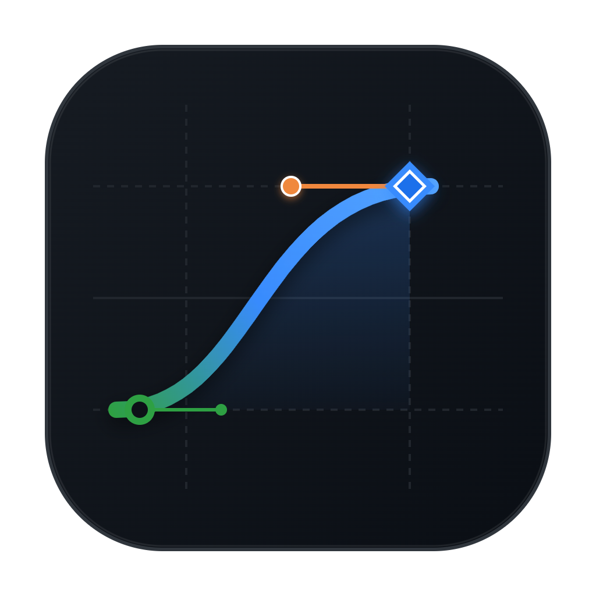
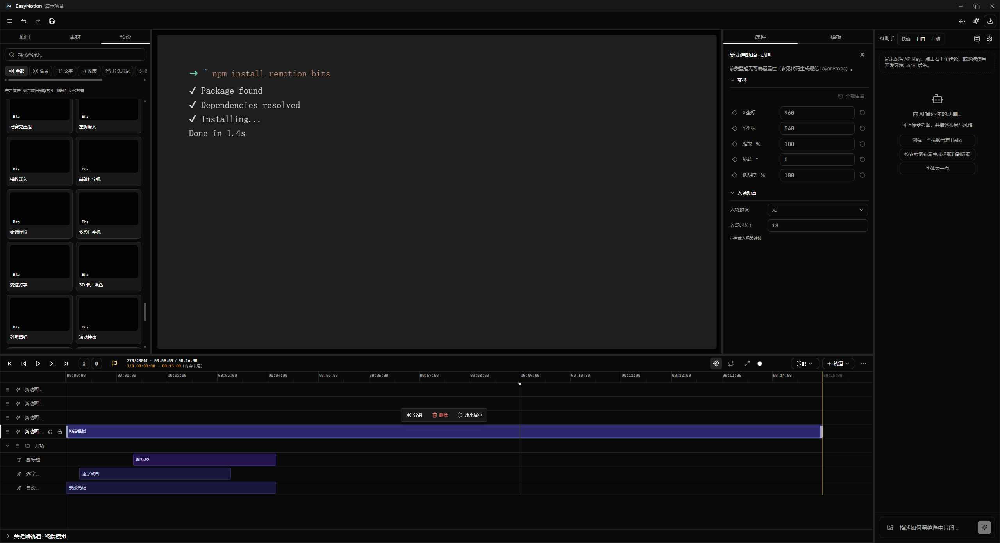

<div align="center">
  

  <h1>EasyMotion</h1>

  <p><strong>用自然语言驱动时间线，用 Remotion 完成动画。</strong></p>
  <p>面向剪辑师和内容创作者的 Windows 桌面动画应用。</p>

  <p>
    <strong>简体中文</strong> · <a href="README.en.md">English</a>
  </p>

  <p><code>Electron</code> · <code>React</code> · <code>Remotion</code> · <code>LangChain</code> · <code>FastAPI</code></p>
</div>



EasyMotion 将对话式 AI 与可视化时间线结合起来：你可以用自然语言创建和调整动画，也可以直接编辑素材、关键帧、预设参数与工作区，并实时预览和导出结果。

> 当前处于 Windows 预发行阶段，适合体验和开发测试。

## 核心能力

- **AI 时间线编辑**：通过自然语言添加、移动和调整动画、素材、数据与关键帧。
- **实时 Remotion 预览**：时间线 JSON 驱动动态 `MainSequence`，修改后自动刷新。
- **可视化时间线**：支持拖拽、吸附、I/O 工作区、撤销/重做和关键帧编辑。
- **123 个动画预设**：包含 81 个 RVE 预设和 42 个 Remotion Bits 预设。
- **素材与自定义组件**：管理本地素材，并允许 AI 创建和维护项目内 Remotion 组件。
- **多种导出方式**：支持 MP4、WebM 和完整 Remotion 工程 ZIP。

## 下载

Windows x64 测试安装包：

- [百度网盘下载](https://pan.baidu.com/s/1IszD8X-GDhq-hjcH9cN0Lg?pwd=ncwr)（提取码：`ncwr`）

安装版已内置 Python。当前安装包未签名，Windows SmartScreen 可能显示安全提示。首次使用 AI 时，请在 **AI 助手 → 设置** 中配置 API Key。

问题反馈请前往 [GitHub Issues](https://github.com/qiuku2022/Easy-Motion/issues)。

## 本地开发

### 环境要求

- Node.js 20+
- pnpm 10+
- Python 3.11+（仅 FastAPI 服务和 Windows 打包需要）

### 启动应用

```bash
pnpm install
pnpm dev
```

`pnpm dev` 会启动 Vite 渲染进程和 Electron，不依赖 Python。AI Key 可在应用内配置，也可以将 `apps/electron/.env.example` 复制为 `.env`。

需要同时启动 FastAPI 时，先在项目根目录初始化 Python 环境：

```powershell
python -m venv apps/python/.venv
.\apps\python\.venv\Scripts\python.exe -m pip install -r apps/python/requirements.txt
pnpm dev:all
```

### 常用命令

| 命令 | 用途 |
| --- | --- |
| `pnpm dev` | 启动 Electron 和渲染进程 |
| `pnpm dev:all` | 同时启动 FastAPI |
| `pnpm check` | 运行 lint、类型检查和核心测试 |
| `pnpm test:release` | 执行导出与真实渲染验证 |
| `pnpm build:win` | 构建 Windows 安装包 |

Windows 打包、预设缩略图和调试说明见[构建与部署](docs/requirements/构建与部署.md)与[开发环境搭建指南](docs/requirements/开发环境搭建指南.md)。

## 仓库结构

```text
apps/electron/     Electron 主进程、Preload、React UI 和 Remotion
apps/python/       可选 FastAPI 服务
packages/shared/   共享时间线模型与逻辑
docs/requirements/ 产品、架构和开发文档
```

## 文档

- [开发环境搭建](docs/requirements/开发环境搭建指南.md)
- [构建与部署](docs/requirements/构建与部署.md)
- [产品与技术文档](docs/requirements/)
- [Agent 开发约束](AGENTS.md)

## 许可证

EasyMotion 基于 MIT License 发布。Remotion 及其他依赖的许可说明见[依赖清单与许可证](docs/requirements/依赖清单与许可证.md)。
